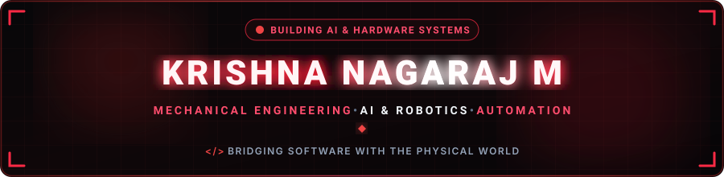
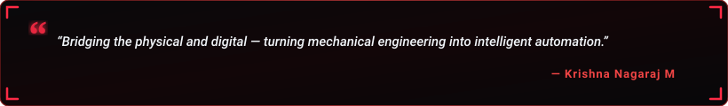

  

  

  
  &nbsp;
  
  &nbsp;
  

  

---

<h2 align="center">🔴 About Me</h2>

  

  

  Hey! I'm <b>Krishna Nagaraj M</b>, a passionate <b>Mechanical Engineering student</b> at <b>Shiv Nadar University, Chennai</b>. 
  I specialize in developing AI-powered projects, desktop automation, and exploring how modern software interacts seamlessly with the physical world through robotics and hardware systems.

  
  &nbsp;
  
  &nbsp;
  

  💬 <b>Let's Discuss:</b> AI Assistants, Automation, Robotics, Drones, Hardware Projects, Python, and AI + Mechanical Engineering. 
  ⚡ <b>Philosophy:</b> <i>"Bridging the physical and digital world — turning mechanical engineering into intelligent automation."</i>

<table width="100%" border="0" align="center">
<tr>
<td width="50%" align="center" style="padding: 14px;">
  <h4>🔭 Flagship Project</h4>
  
<a href="https://github.com/krishnadvrrr" target="_blank"><b>JARVIS</b></a> Personal AI Assistant &amp; Workflow Automation

</td>
<td width="50%" align="center" style="padding: 14px;">
  <h4>🌱 Active Deep Dives</h4>
  
<b>AI Agents &amp; Python</b> Desktop Automation &amp; System Interfacing

</td>
</tr>
<tr>
<td width="50%" align="center" style="padding: 14px;">
  <h4>🤖 Robotics &amp; Drones</h4>
  
<b>Hardware Systems</b> Sensors, Microcontrollers &amp; Dynamics

</td>
<td width="50%" align="center" style="padding: 14px;">
  <h4>🤝 Collaboration</h4>
  
<b>AI, Robotics &amp; Python</b> Open to innovative physical &amp; digital projects

</td>
</tr>
</table>

---

<h2 align="center">🔴 Featured Project Spotlight</h2>

<table width="100%" border="0" align="center">
<tr>
<td align="center" style="padding: 22px;">
  <h3>🤖 JARVIS — Personal AI Assistant</h3>
  
<i>A smart personal AI assistant engineered to interact with applications, automate repetitive desktop workflows, and execute browser actions dynamically.</i>

   
  

    
  

</td>
</tr>
</table>

---

<h2 align="center">🛠️ Tech Stack &amp; Skills</h2>

<b>Core Programming &amp; Scripting</b>

  

<b>Frontend &amp; Web Technologies</b>

  

<b>Backend, Database &amp; Deployment</b>

  

<b>Tools, Workflow &amp; Environment</b>

  

  
  &nbsp;
  
  &nbsp;
  
  &nbsp;
  
  &nbsp;
  

---

<h2 align="center">📊 GitHub Analytics &amp; Activity</h2>

  
  &nbsp;&nbsp;
  

  

  

---

<h2 align="center">⚡ Contribution Journey</h2>

  

---

<h2 align="center">📬 Let's Connect &amp; Collaborate</h2>

<i>Whether you want to discuss AI assistants, robotics, hardware integration, or explore collaboration — my inbox is always open!</i>

<table border="0" align="center">
<tr>
<td align="center" width="220" style="padding: 16px;">
  <a href="https://www.linkedin.com/in/krishna-nagaraj-m-9ab355435/" target="_blank">
    
      
    
  </a>
   
  <b>Professional Network</b>
</td>
<td align="center" width="220" style="padding: 16px;">
  <a href="mailto:zenpai901@gmail.com">
    
      
    
  </a>
   
  <b>Direct Collaboration</b>
</td>
</tr>
</table>

  

